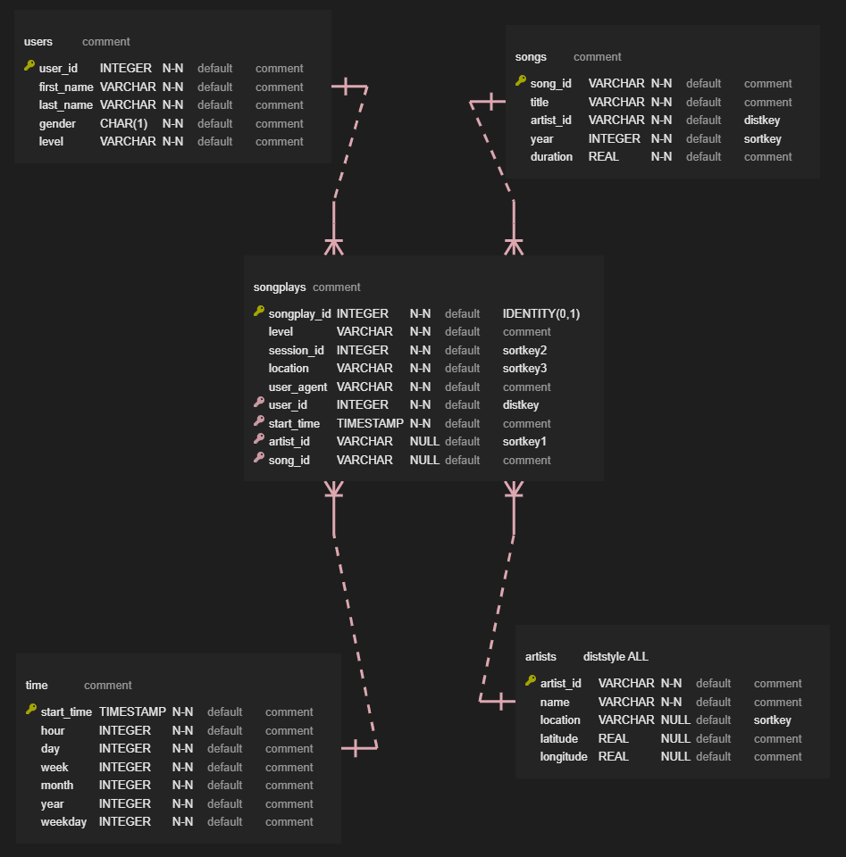
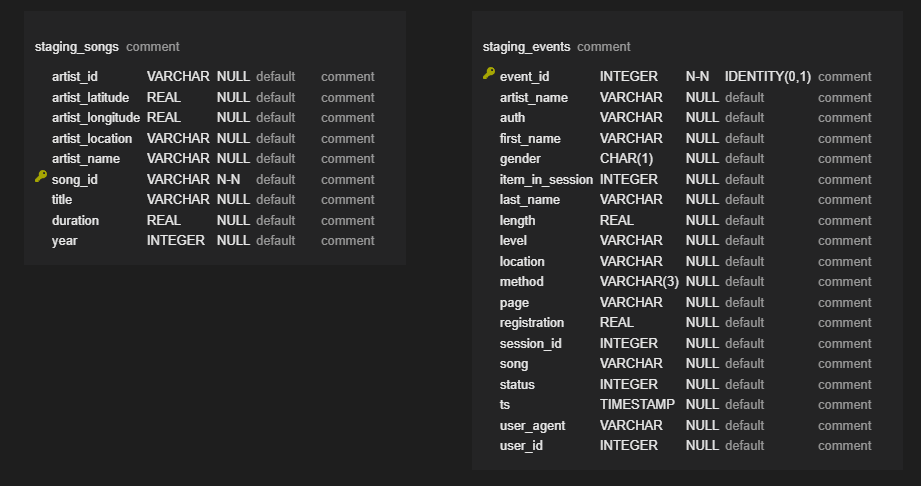

# Data Warehouse

## Introduction
A music streaming startup, Sparkify, has grown their user base and song database and want to move their processes and data onto the cloud. Their data resides in S3, in a directory of JSON logs on user activity on the app, as well as a directory with JSON metadata on the songs in their app.

In this project an ETL pipeline is build that extracts their data from S3, stages them in Redshift, and transforms data into a set of dimensional tables and fact table for their analytics team to continue finding insights in what songs their users are listening to.

## Project Structure
```
    .ProjectWorkspace                           # main folder 
    ├── images                                  # images
    │   ├── erm.png
    │   ├── log-data.png
    │   ├── staging_tables.png
    ├── cluster_management.ipynb                # creates the cluster and IAM role on AWS
    ├── cluster.cfg                             # contains parameters for cluster creation
    ├── create_tables.py                        # creates the Redshift database
    ├── dwh.cfg                                 # contains parameters for cluster/db access
    ├── etl.py                                  # loads staging tables, transforms data, and loads data into analytic tables
    ├── execution.ipynb                         # runs create_tables.py and etl.py
    ├── README.md                               # provides discussion on the project
    └── sql_queries.py                          # contains all the sql queries and copy statements
```

## Datasets

The two datasets that we are working on reside in S3. Here are the S3 links for each:

```
- Song data: s3://udacity-dend/song_data
- Log data: s3://udacity-dend/log_data
Log data json path: s3://udacity-dend/log_json_path.json
```

### Song Dataset
The first dataset is a subset of real data from the Million Song Dataset. Each file is in JSON format and contains metadata about a song and the artist of that song. The files are partitioned by the first three letters of each song's track ID. For example, here are filepaths to two files in this dataset.

```
song_data/A/B/C/TRABCEI128F424C983.json
song_data/A/A/B/TRAABJL12903CDCF1A.json

```

And below is an example of what a single song file, TRAABJL12903CDCF1A.json, looks like.

```
{"num_songs": 1, "artist_id": "ARJIE2Y1187B994AB7", "artist_latitude": null, "artist_longitude": null, "artist_location": "", "artist_name": "Line Renaud", "song_id": "SOUPIRU12A6D4FA1E1", "title": "Der Kleine Dompfaff", "duration": 152.92036, "year": 0}

```

### Log Dataset
The second dataset consists of log files in JSON format generated by an event simulator based on the songs in the dataset above. These simulate activity logs from a music streaming app based on specified configurations.

The log files in the dataset you'll be working with are partitioned by year and month. For example, here are filepaths to two files in this dataset.

```
log_data/2018/11/2018-11-12-events.json
log_data/2018/11/2018-11-13-events.json

```

And below is an example of what the data in a log file, 2018-11-12-events.json, looks like.


## Database Schema

The following picture states the ERM for the Redshift database dwhsparkify. The database is a star schema optimized for queries on song play analysis. It contains the fact table songplays and the dimension tables users, songs, artists, and time.


The following picture states the structure of the staging tables that are used to load data into the database. Their structure is identical to the json file structure, except that staging_events got an event_id for unique identification.
They are only used to load the data, transform the data, and copy the data to the analytic tables



## ETL pipeline

The data is loaded from the S3 bucket (json-files) into the staging tables.

The data from staging_songs is inserted into songs and artist table.
The data from staging_events is filtered by page = 'NextSong' and it is made sure no NULL values are inserted in the analytic tables.

## Steps to launch the ETL pipeline

### 1 Cluster and IAM-role creation

To be able to load the database or to run the ETL pipeline a cluster and an IAM-role that has read access to S3 are needed. Make sure you have a cluster and IAM-role created or you can use cluster_management.ipynb to create those, but you have to adapt the parameters in cluster.cfg.

#### cluster_management.ipynb

This notebook contains all steps to create/delete an IAM-role and a cluster on AWS.

### 2 Database creation

Next step is to create the database. The file executuion.ipynb can be used to create the database.
create_tables.py can be run whenever there is the need to reset the database, because it deletes the database and creates it fresh.
Make sure you have a cluster and IAM-role created or you can use cluster_management.ipynb to create those, but you have to adapt the parameters in dwh.cfg.

### 3 Executing the ETL pipeline

Next step is to run the ETL. The file execution.ipynb can be used to run the ETL.

The data is processed in the following way:
Loads data from S3 into staging tables -> convert/insert data into analytic tables (fact and dimension tables)